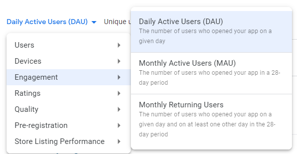
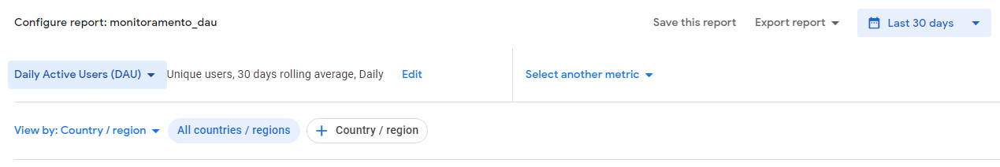
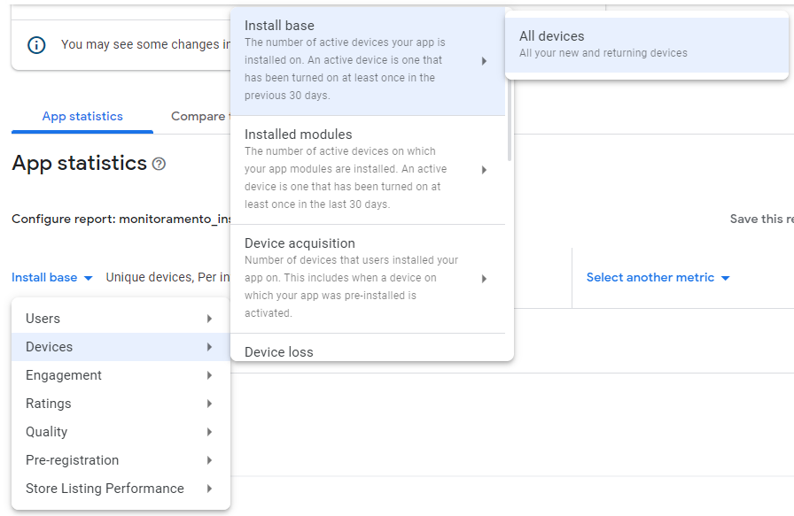
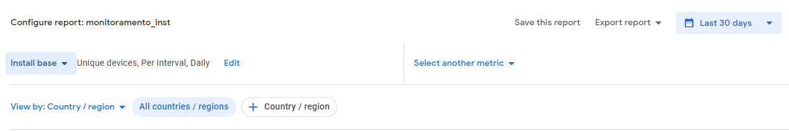

# Análise de comentários

Este repositório contém um *script*, acompanhado de uma imagem *docker*, para extração e análise de comentários sobre o aplicativo Gov.br da loja de aplicativos da Google.

## Pré-requisitos

1. Acesso ao aplicativo Gov.br na conta de desenvolvedor "Serviços e Infomações do Brasil" no <a href="https://play.google.com/console" target="_blank">Google Play Console</a> com sua conta do Google.

2. Configurar sua conta do Google para o idioma Inglês (<a href="https://myaccount.google.com/language" target="_blank">neste link</a>). Essa configuração é necessária para que os arquivos de estatística de uso do aplicativo sejam baixados com os nomes de coluna corretos.

3. Instalar o <a href="https://www.docker.com/products/docker-desktop/" target="_blank">Docker</a>.

    3.1. Caso você use Windows, antes de instalar o Docker, instale o <a href="https://docs.microsoft.com/pt-br/windows/wsl/install" target="_blank">WSL</a>.

## Preparando as estatísticas para rodar o *script*

Antes de começar a rodar o *script*, é necessário atualizar os arquivos de estatísticas de uso do aplicativo para poder gerar os indicadores de uso. Para tanto:

1. Acesse o <a href="https://play.google.com/console/u/0/developers/5829287075355252046/app/4976204475855033311/statistics">Painel de Estatísticas</a> do aplicativo Gov.br no Google Play Console.

2. No canto superior direito, "Saved Reports":

    2.1. Escolha `monitoramento_dau`. Este relatório está configurado como "Engagement -> Daily Active Users (DAU)" e está configurado para `Unique users, 30 days rolling average, daily, All countries/regions`.

    <br>

    2.2. No período do relatório, selecione "All Time". Depois de selecionar all time, certifique-se que as configurações do relatório permanecem as mesmas do item 2.1. Caso não permaneçam, escolha novamente `monitoramento_dau` na lista de "Saved Reports".

    2.3. Clique em "Export Report -> Export Time Series (CSV)", e salve o relatório em `data/monitoramento_dau.csv`.

    2.4. Escolha agora `monitoramento_inst`. Este relatório está configurado como "Devices -> Install Base -> All Devices" e está configurado para `Unique devices, Per interval, Daily, All countries/regions`.

    <br>

    2.5. No período do relatório, selecione "All Time". Depois de selecionar all time, certifique-se que as configurações do relatório permanecem as mesmas do item 2.4. Caso não permaneçam, escolha novamente `monitoramento_inst` na lista de "Saved Reports".

    2.6. Clique em "Export Report -> Export Time Series (CSV)", e salve o relatório em `data/monitoramento_inst.csv`.

## Configurando o docker para rodar o *script*

Certifique se instalar o Docker antes de continuar com esta etapa. Veja a seção de [Pré-requisitos](#pré-requisitos).

Tendo instalado o docker, abra o terminal do `bash`. (Se você usa Windows, pode abrir o terminal do WSL, que por padrão vai abrir o `bash` do Ubuntu.)

Navegue no terminal até este diretório e entre com o comando:
```
docker-compose up
```
Este comando fará com que se instalem todas as dependências para rodar o *script* e rodará o *script*. Nesta etapa, pode ser necessário alguma depuração devido à necessidade de muitas dependências que podem ir mudando com o tempo.

## Visualizando os resultados

Basta abrir o arquivo `Reviews_Painel.pbix`. Depois de atualizado o banco de dados, com a imagem *docker* `analise_comentarios-db-1` rodando, no painel, ir em `Arquivo -> Opções e configurações -> Configurações da fonte de dados` e, na tela que abrir, ir em `Alterar fonte`, apontando para o endereço e porta de onde estiver rodando a imagem *docker*.